# Model-Booster diagrams

## agent-auto-evaluator

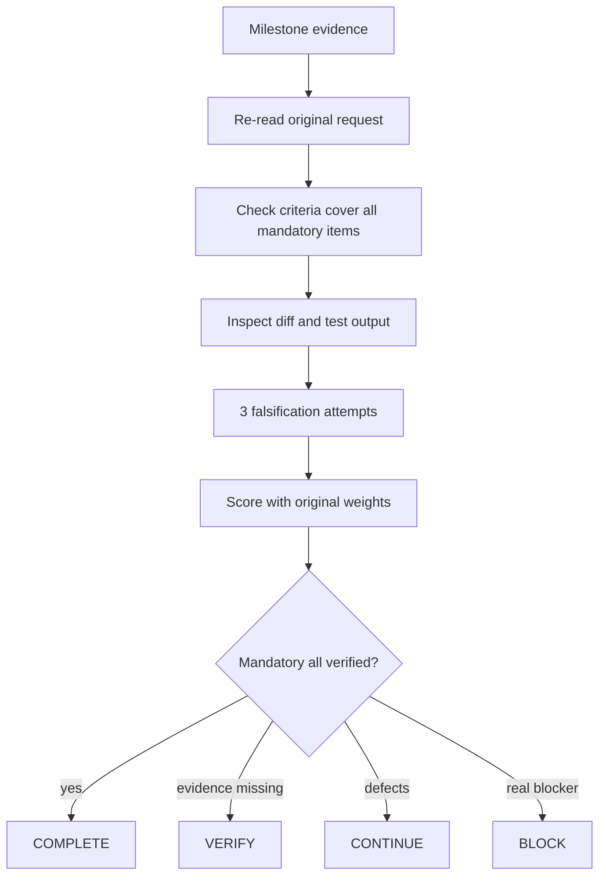
```mermaid
flowchart TD
  A["Milestone evidence"] --> B["Re-read original request"]
  B --> C["Check criteria cover all mandatory items"]
  C --> D["Inspect diff and test output"]
  D --> E["3 falsification attempts"]
  E --> F["Score with original weights"]
  F --> G{"Mandatory all verified?"}
  G -- yes --> H["COMPLETE"]
  G -- "evidence missing" --> I["VERIFY"]
  G -- "defects" --> J["CONTINUE"]
  G -- "real blocker" --> K["BLOCK"]
```

## agent-auto

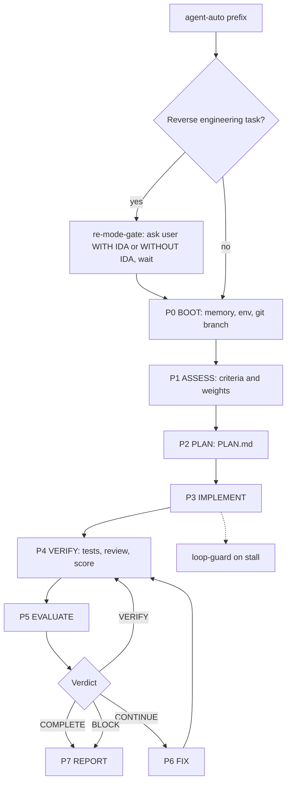
```mermaid
flowchart TD
  A["agent-auto prefix"] --> RG{"Reverse engineering task?"}
  RG -- yes --> M["re-mode-gate: ask user WITH IDA or WITHOUT IDA, wait"]
  M --> P0
  RG -- no --> P0["P0 BOOT: memory, env, git branch"]
  P0 --> P1["P1 ASSESS: criteria and weights"]
  P1 --> P2["P2 PLAN: PLAN.md"]
  P2 --> P3["P3 IMPLEMENT"]
  P3 --> P4["P4 VERIFY: tests, review, score"]
  P4 --> P5["P5 EVALUATE"]
  P5 --> V{"Verdict"}
  V -- COMPLETE --> P7["P7 REPORT"]
  V -- CONTINUE --> P6["P6 FIX"] --> P4
  V -- VERIFY --> P4
  V -- BLOCK --> P7
  P3 -.-> LG["loop-guard on stall"]
```

## booster-core

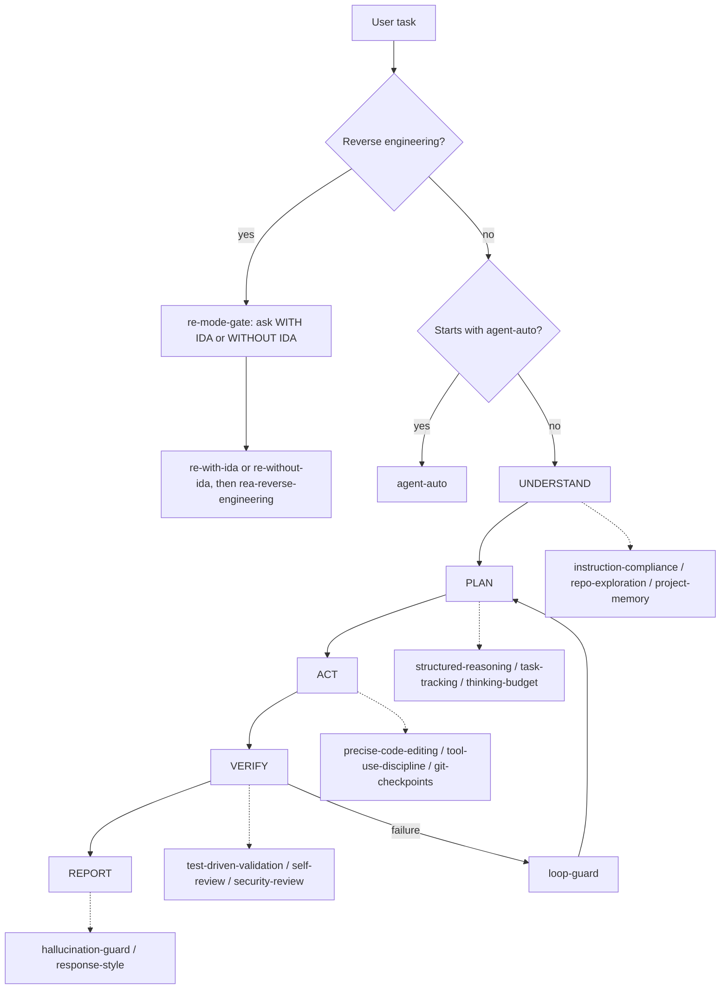
```mermaid
flowchart TD
  A["User task"] --> R{"Reverse engineering?"}
  R -- yes --> M["re-mode-gate: ask WITH IDA or WITHOUT IDA"]
  M --> RE["re-with-ida or re-without-ida, then rea-reverse-engineering"]
  R -- no --> B{"Starts with agent-auto?"}
  B -- yes --> C["agent-auto"]
  B -- no --> D["UNDERSTAND"]
  D --> E["PLAN"] --> F["ACT"] --> G["VERIFY"] --> H["REPORT"]
  D -.-> S1["instruction-compliance / repo-exploration / project-memory"]
  E -.-> S2["structured-reasoning / task-tracking / thinking-budget"]
  F -.-> S3["precise-code-editing / tool-use-discipline / git-checkpoints"]
  G -.-> S4["test-driven-validation / self-review / security-review"]
  H -.-> S5["hallucination-guard / response-style"]
  G -- "failure" --> L["loop-guard"] --> E
```

## clarification-policy

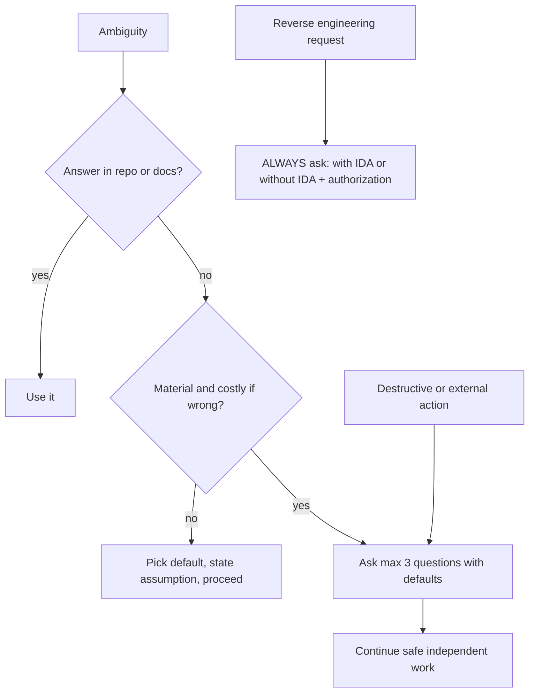
```mermaid
flowchart TD
  A["Ambiguity"] --> B{"Answer in repo or docs?"}
  B -- yes --> C["Use it"]
  B -- no --> D{"Material and costly if wrong?"}
  D -- no --> E["Pick default, state assumption, proceed"]
  D -- yes --> F["Ask max 3 questions with defaults"]
  F --> G["Continue safe independent work"]
  H["Destructive or external action"] --> F
  R["Reverse engineering request"] --> Q["ALWAYS ask: with IDA or without IDA + authorization"]
```

## context-management

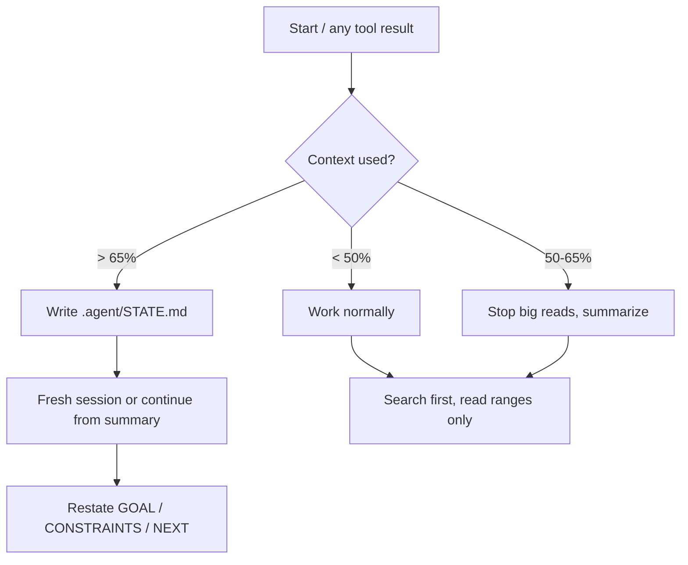
```mermaid
flowchart TD
  A["Start / any tool result"] --> B{"Context used?"}
  B -- "< 50%" --> C["Work normally"]
  B -- "50-65%" --> D["Stop big reads, summarize"]
  B -- "> 65%" --> E["Write .agent/STATE.md"]
  E --> F["Fresh session or continue from summary"]
  F --> G["Restate GOAL / CONSTRAINTS / NEXT"]
  C --> H["Search first, read ranges only"]
  D --> H
```

## function-quality-score

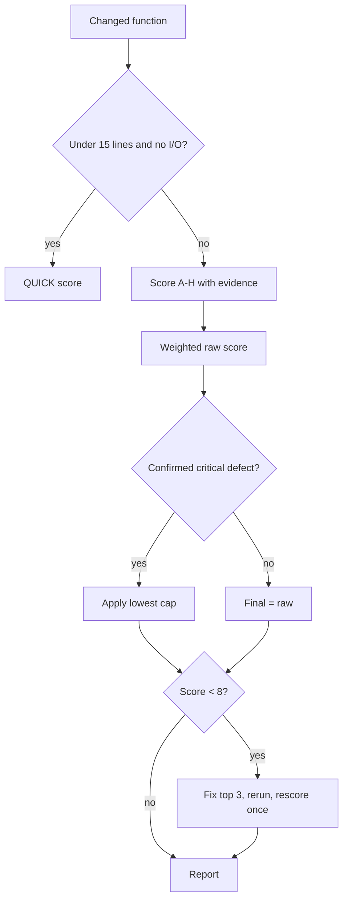
```mermaid
flowchart TD
  A["Changed function"] --> B{"Under 15 lines and no I/O?"}
  B -- yes --> C["QUICK score"]
  B -- no --> D["Score A-H with evidence"]
  D --> E["Weighted raw score"]
  E --> F{"Confirmed critical defect?"}
  F -- yes --> G["Apply lowest cap"]
  F -- no --> H["Final = raw"]
  G & H --> I{"Score < 8?"}
  I -- yes --> J["Fix top 3, rerun, rescore once"]
  I -- no --> K["Report"]
  J --> K
```

## git-checkpoints

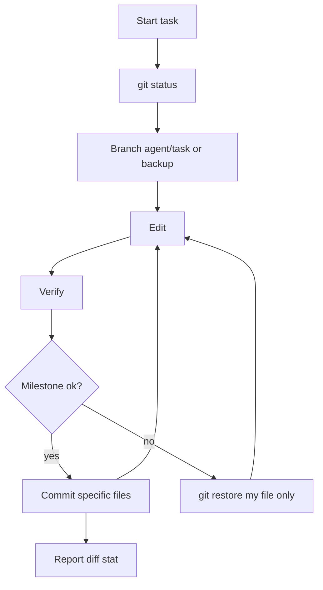
```mermaid
flowchart TD
  A["Start task"] --> B["git status"]
  B --> C["Branch agent/task or backup"]
  C --> D["Edit"]
  D --> E["Verify"]
  E --> F{"Milestone ok?"}
  F -- yes --> G["Commit specific files"]
  F -- no --> H["git restore my file only"]
  G --> D
  H --> D
  G --> I["Report diff stat"]
```

## hallucination-guard

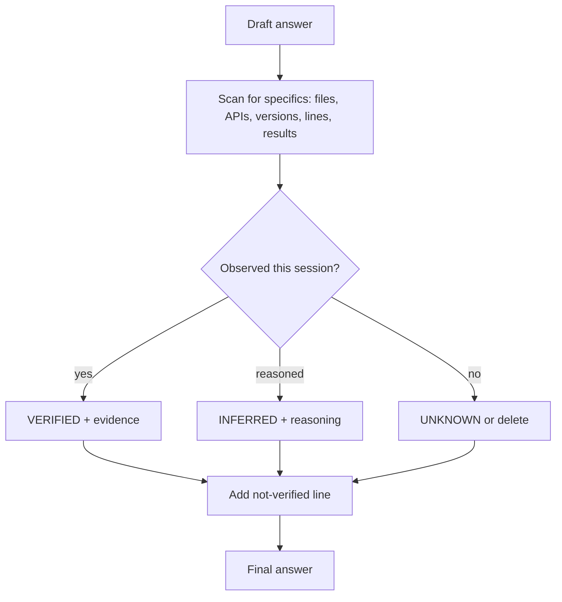
```mermaid
flowchart TD
  A["Draft answer"] --> B["Scan for specifics: files, APIs, versions, lines, results"]
  B --> C{"Observed this session?"}
  C -- yes --> D["VERIFIED + evidence"]
  C -- reasoned --> E["INFERRED + reasoning"]
  C -- no --> F["UNKNOWN or delete"]
  D & E & F --> G["Add not-verified line"]
  G --> H["Final answer"]
```

## instruction-compliance

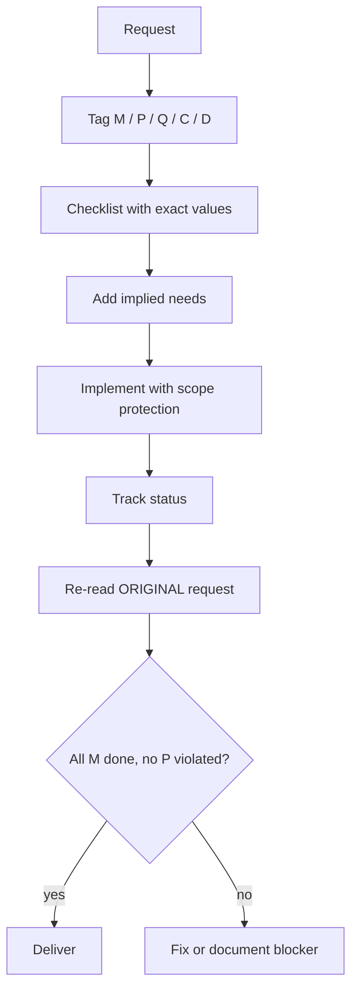
```mermaid
flowchart TD
  A["Request"] --> B["Tag M / P / Q / C / D"]
  B --> C["Checklist with exact values"]
  C --> D["Add implied needs"]
  D --> E["Implement with scope protection"]
  E --> F["Track status"]
  F --> G["Re-read ORIGINAL request"]
  G --> H{"All M done, no P violated?"}
  H -- yes --> I["Deliver"]
  H -- no --> J["Fix or document blocker"]
```

## long-output-chunking

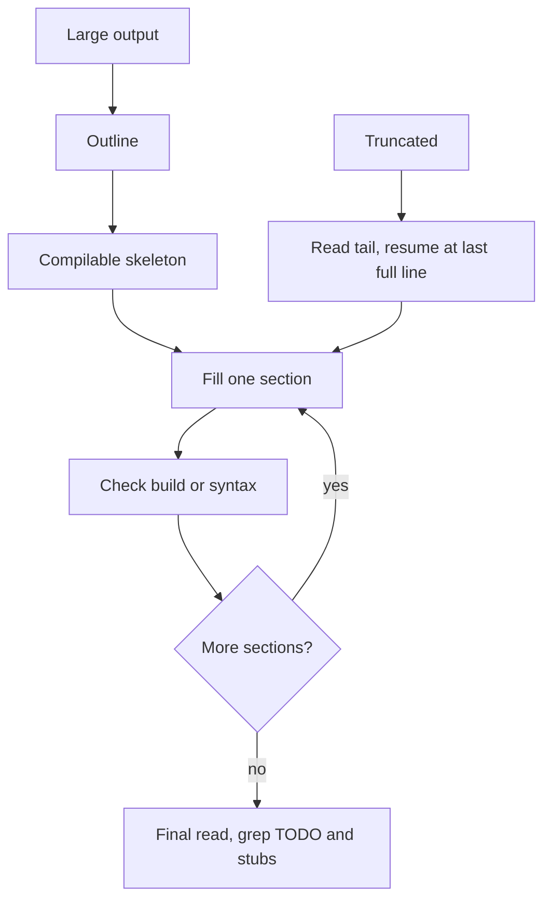
```mermaid
flowchart TD
  A["Large output"] --> B["Outline"]
  B --> C["Compilable skeleton"]
  C --> D["Fill one section"]
  D --> E["Check build or syntax"]
  E --> F{"More sections?"}
  F -- yes --> D
  F -- no --> G["Final read, grep TODO and stubs"]
  H["Truncated"] --> I["Read tail, resume at last full line"] --> D
```

## loop-guard

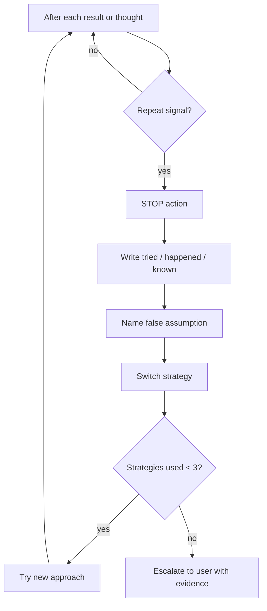
```mermaid
flowchart TD
  A["After each result or thought"] --> B{"Repeat signal?"}
  B -- no --> A
  B -- yes --> C["STOP action"]
  C --> D["Write tried / happened / known"]
  D --> E["Name false assumption"]
  E --> F["Switch strategy"]
  F --> G{"Strategies used < 3?"}
  G -- yes --> H["Try new approach"] --> A
  G -- no --> I["Escalate to user with evidence"]
```

## precise-code-editing

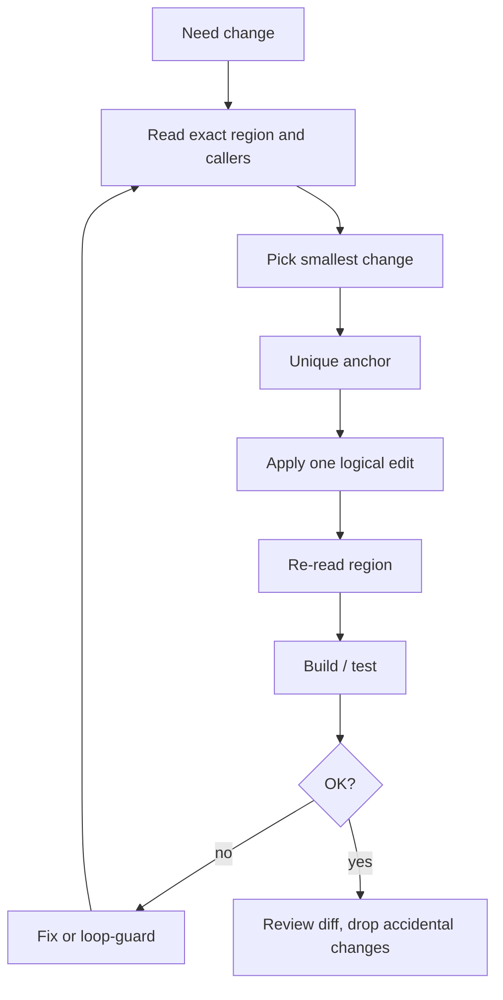
```mermaid
flowchart TD
  A["Need change"] --> B["Read exact region and callers"]
  B --> C["Pick smallest change"]
  C --> D["Unique anchor"]
  D --> E["Apply one logical edit"]
  E --> F["Re-read region"]
  F --> G["Build / test"]
  G --> H{"OK?"}
  H -- no --> I["Fix or loop-guard"] --> B
  H -- yes --> J["Review diff, drop accidental changes"]
```

## programming-knowledge

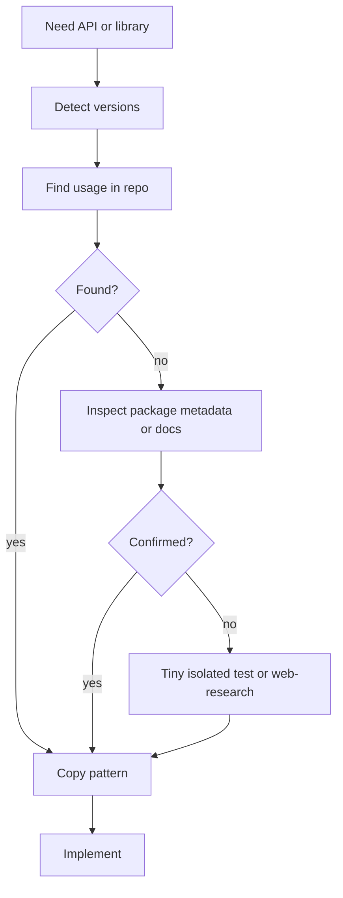
```mermaid
flowchart TD
  A["Need API or library"] --> B["Detect versions"]
  B --> C["Find usage in repo"]
  C --> D{"Found?"}
  D -- yes --> E["Copy pattern"]
  D -- no --> F["Inspect package metadata or docs"]
  F --> G{"Confirmed?"}
  G -- no --> H["Tiny isolated test or web-research"]
  G -- yes --> E
  H --> E
  E --> I["Implement"]
```

## project-memory

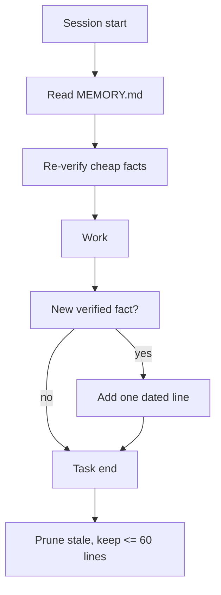
```mermaid
flowchart TD
  A["Session start"] --> B["Read MEMORY.md"]
  B --> C["Re-verify cheap facts"]
  C --> D["Work"]
  D --> E["New verified fact?"]
  E -- yes --> F["Add one dated line"]
  E -- no --> G["Task end"]
  F --> G
  G --> H["Prune stale, keep <= 60 lines"]
```

## re-evidence-discipline

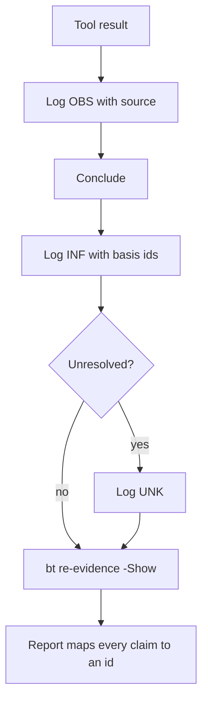
```mermaid
flowchart TD
  A["Tool result"] --> B["Log OBS with source"]
  B --> C["Conclude"]
  C --> D["Log INF with basis ids"]
  D --> E{"Unresolved?"}
  E -- yes --> F["Log UNK"]
  E -- no --> G["bt re-evidence -Show"]
  F --> G
  G --> H["Report maps every claim to an id"]
```

## re-mode-gate

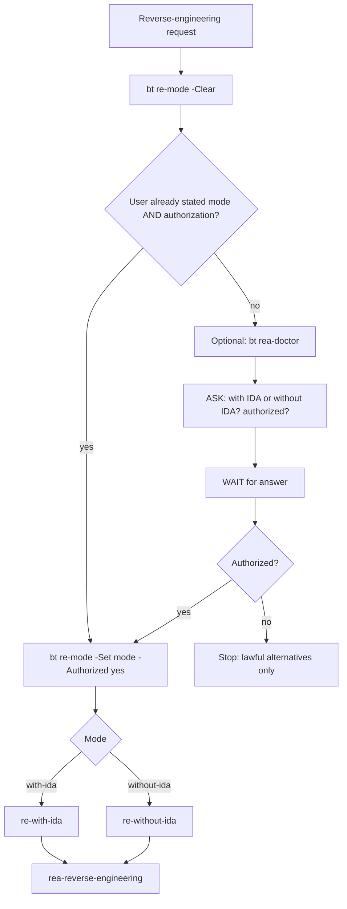
```mermaid
flowchart TD
  A["Reverse-engineering request"] --> B["bt re-mode -Clear"]
  B --> C{"User already stated mode AND authorization?"}
  C -- yes --> F["bt re-mode -Set mode -Authorized yes"]
  C -- no --> D["Optional: bt rea-doctor"]
  D --> E["ASK: with IDA or without IDA? authorized?"]
  E --> W["WAIT for answer"]
  W --> G{"Authorized?"}
  G -- no --> X["Stop: lawful alternatives only"]
  G -- yes --> F
  F --> H{"Mode"}
  H -- with-ida --> I["re-with-ida"]
  H -- without-ida --> J["re-without-ida"]
  I --> K["rea-reverse-engineering"]
  J --> K
```

## re-with-ida

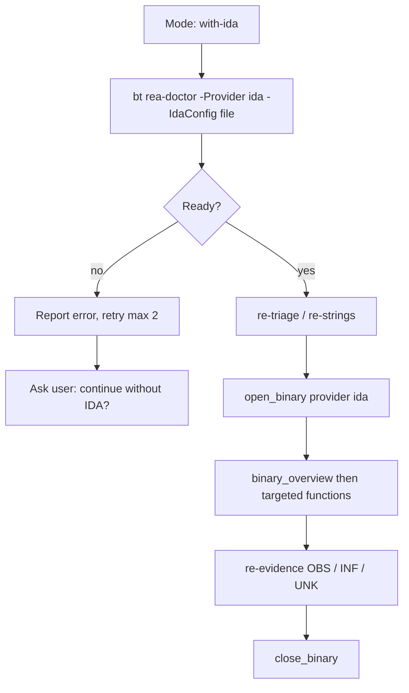
```mermaid
flowchart TD
  A["Mode: with-ida"] --> B["bt rea-doctor -Provider ida -IdaConfig file"]
  B --> C{"Ready?"}
  C -- no --> D["Report error, retry max 2"]
  D --> E["Ask user: continue without IDA?"]
  C -- yes --> F["re-triage / re-strings"]
  F --> G["open_binary provider ida"]
  G --> H["binary_overview then targeted functions"]
  H --> I["re-evidence OBS / INF / UNK"]
  I --> J["close_binary"]
```

## re-without-ida

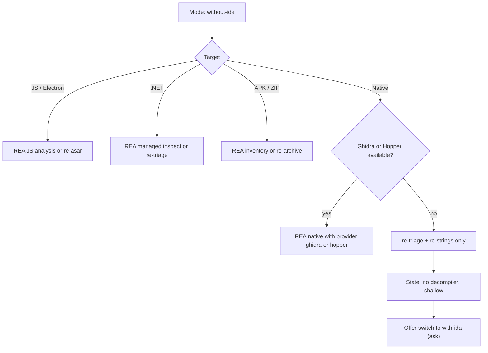
```mermaid
flowchart TD
  A["Mode: without-ida"] --> B{"Target"}
  B -- "JS / Electron" --> C["REA JS analysis or re-asar"]
  B -- ".NET" --> D["REA managed inspect or re-triage"]
  B -- "APK / ZIP" --> E["REA inventory or re-archive"]
  B -- "Native" --> F{"Ghidra or Hopper available?"}
  F -- yes --> G["REA native with provider ghidra or hopper"]
  F -- no --> H["re-triage + re-strings only"]
  H --> I["State: no decompiler, shallow"]
  I --> J["Offer switch to with-ida (ask)"]
```

## rea-reverse-engineering

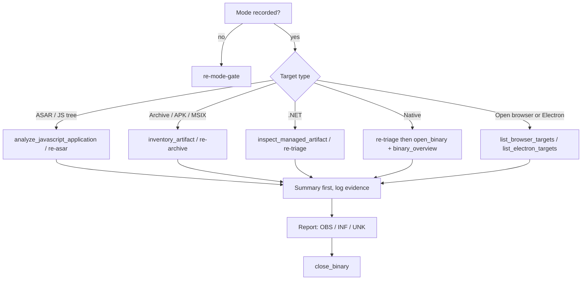
```mermaid
flowchart TD
  A["Mode recorded?"] -- no --> G["re-mode-gate"]
  A -- yes --> B{"Target type"}
  B -- "ASAR / JS tree" --> C["analyze_javascript_application / re-asar"]
  B -- "Archive / APK / MSIX" --> D["inventory_artifact / re-archive"]
  B -- ".NET" --> E["inspect_managed_artifact / re-triage"]
  B -- "Native" --> F["re-triage then open_binary + binary_overview"]
  B -- "Open browser or Electron" --> H["list_browser_targets / list_electron_targets"]
  C & D & E & F & H --> I["Summary first, log evidence"]
  I --> J["Report: OBS / INF / UNK"]
  J --> K["close_binary"]
```

## repo-exploration

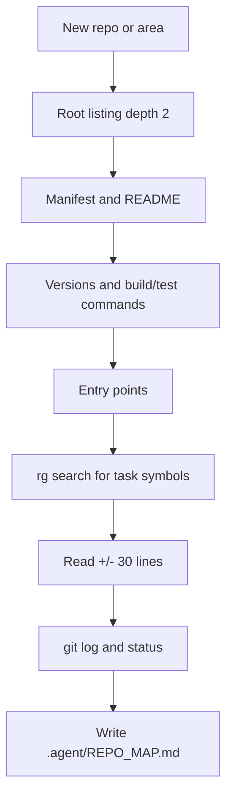
```mermaid
flowchart TD
  A["New repo or area"] --> B["Root listing depth 2"]
  B --> C["Manifest and README"]
  C --> D["Versions and build/test commands"]
  D --> E["Entry points"]
  E --> F["rg search for task symbols"]
  F --> G["Read +/- 30 lines"]
  G --> H["git log and status"]
  H --> I["Write .agent/REPO_MAP.md"]
```

## response-style

```mermaid
flowchart TD
  A["Prepare reply"] --> B["Detect user language"]
  B --> C["Answer or result first"]
  C --> D["Match depth to question"]
  D --> E["Strip filler"]
  E --> F{"Task changed things?"}
  F -- yes --> G["Report: Result / Changed / Verified / Risks / Next"]
  F -- no --> H["Short prose"]
  G & H --> I["Send"]
```

## security-review

```mermaid
flowchart TD
  A["Code with I/O"] --> B["List trust boundaries and sinks"]
  B --> C["Trace input to sink"]
  C --> D{"Validated?"}
  D -- yes --> E["Note safe"]
  D -- no --> F{"Confirmed?"}
  F -- yes --> G["Minimal fix + regression test"]
  F -- no --> H["Mark PLAUSIBLE, investigate"]
  G --> I["Re-scan fix"] --> J["Report by severity"]
```

## self-review

```mermaid
flowchart TD
  A["Candidate solution"] --> B["Pass 1: requirements vs diff"]
  B --> C["Pass 2: one lens at a time"]
  C --> D["3 counterexamples"]
  D --> E{"Evidence-backed defect?"}
  E -- yes --> F["Fix, recheck"] --> G{"Pass < 2?"}
  G -- yes --> C
  G -- no --> H["Report"]
  E -- no --> H
```

## structured-reasoning

```mermaid
flowchart TD
  A["Complex task"] --> B["Restate"]
  B --> C["Facts / assumptions / unknowns"]
  C --> D["Decompose"]
  D --> E["2+ approaches"]
  E --> F["Decision matrix"]
  F --> G["Pre-mortem top 3 risks"]
  G --> H["Plan + acceptance criteria"]
```

## systematic-debugging

```mermaid
flowchart TD
  A["Bug"] --> B["Reproduce and record"]
  B --> C["Minimize"]
  C --> D["Hypothesis table"]
  D --> E["Discriminating observations"]
  E --> F["Root cause by evidence"]
  F --> G["Smallest fix"]
  G --> H["Rerun repro + regressions"]
  H --> I{"Pass?"}
  I -- yes --> J["Report"]
  I -- no --> K["Revisit hypotheses / loop-guard"] --> D
```

## task-tracking

```mermaid
flowchart TD
  A["Task with 3+ steps"] --> B["Write PLAN.md with acceptance and steps"]
  B --> C["Mark one step doing"]
  C --> D["Do step"]
  D --> E["Run its check"]
  E --> F{"Passed?"}
  F -- yes --> G["Mark verified with evidence"]
  F -- no --> H["Mark failed, add fix step"]
  G --> I{"More steps?"}
  H --> C
  I -- yes --> C
  I -- no --> J["Report; unchecked boxes = incomplete"]
```

## test-driven-validation

```mermaid
flowchart TD
  A["Change planned"] --> B["Find or write failing test"]
  B --> C["Implement"]
  C --> D["Focused tests"]
  D --> E["Build and analyzers"]
  E --> F["Regression suite"]
  F --> G["Evidence table"]
  G --> H{"Any failed or not run?"}
  H -- yes --> I["Investigate or state limit"]
  H -- no --> J["Report verified"]
```

## thinking-budget

```mermaid
flowchart TD
  A["Task"] --> B{"Size?"}
  B -- Trivial --> C["Think <= 300"]
  B -- Simple --> D["Think <= 1500"]
  B -- Moderate --> E["Think <= 4000"]
  B -- Hard --> F["Think <= 6500"]
  C & D & E & F --> G["GOAL / FACTS / OPTIONS / DECISION"]
  G --> H{"Decision made?"}
  H -- yes --> I["Act or answer"]
  H -- no --> J{"Budget nearly spent?"}
  J -- yes --> K["Commit best option, flag UNKNOWN"]
  J -- no --> G
```

## tool-use-discipline

```mermaid
flowchart TD
  A["Need a fact or change"] --> B{"Tool exists in list?"}
  B -- no --> X["Report, pick alternative"]
  B -- yes --> C["Validate args and safety class"]
  C --> D{"Destructive?"}
  D -- yes --> E["Ask authorization"]
  D -- no --> F["Call once, wait"]
  E --> F
  F --> G["Check exit code and output"]
  G --> H{"Error?"}
  H -- no --> I["Record evidence"]
  H -- yes --> J{"Retry count < 2?"}
  J -- yes --> K["Change something, retry"] --> F
  J -- no --> L["loop-guard"]
```

## web-research

```mermaid
flowchart TD
  A["Knowledge gap"] --> B{"Web available?"}
  B -- no --> C["Local docs, package source, experiment, label INFERRED"]
  B -- yes --> D["Precise versioned query"]
  D --> E["Prefer official sources"]
  E --> F["Open page, check version"]
  F --> G["Evidence summary"]
  G --> H["Implement"]
  H --> I["Test"]
  I --> J{"Fails?"}
  J -- yes --> K["Search the specific failure, budget 8"] --> E
  J -- no --> L["Report with sources"]
```

## windows-dev-environment

```mermaid
flowchart TD
  A["Run command"] --> B["Assume PowerShell"]
  B --> C["Get-Command tool check"]
  C --> D{"Installed?"}
  D -- no --> E["Use alternative"]
  D -- yes --> F["Quote paths, correct syntax"]
  F --> G{"Touches files?"}
  G -- yes --> H["Keep CRLF and encoding"]
  G -- no --> I["Run"]
  H --> I
  I --> J{"GPU heavy?"}
  J -- yes --> K["Check nvidia-smi VRAM first"]
  J -- no --> L["Done"]
```
